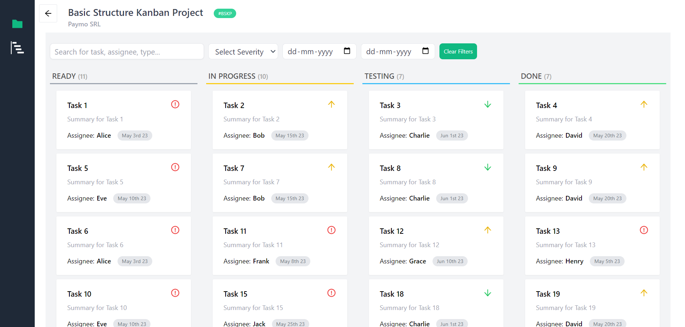

# Kanban Board Project

This project is a Kanban board application built using React, `react-beautiful-dnd`, `antd`, `tailwind CSS`, and `react context` for state management. The application allows users to create, manage, and organize tasks using a drag-and-drop interface.

## Features

- Organize tasks into different columns (e.g., Ready, In Progress,Testing, Done).
- Drag-and-drop tasks to change their status.
- Search, filters based on criticality, date.
- See task metrics such as efforts spent, number of tasks based on category.
- Responsive design with `antd` components and custom `tailwind CSS` styling.

